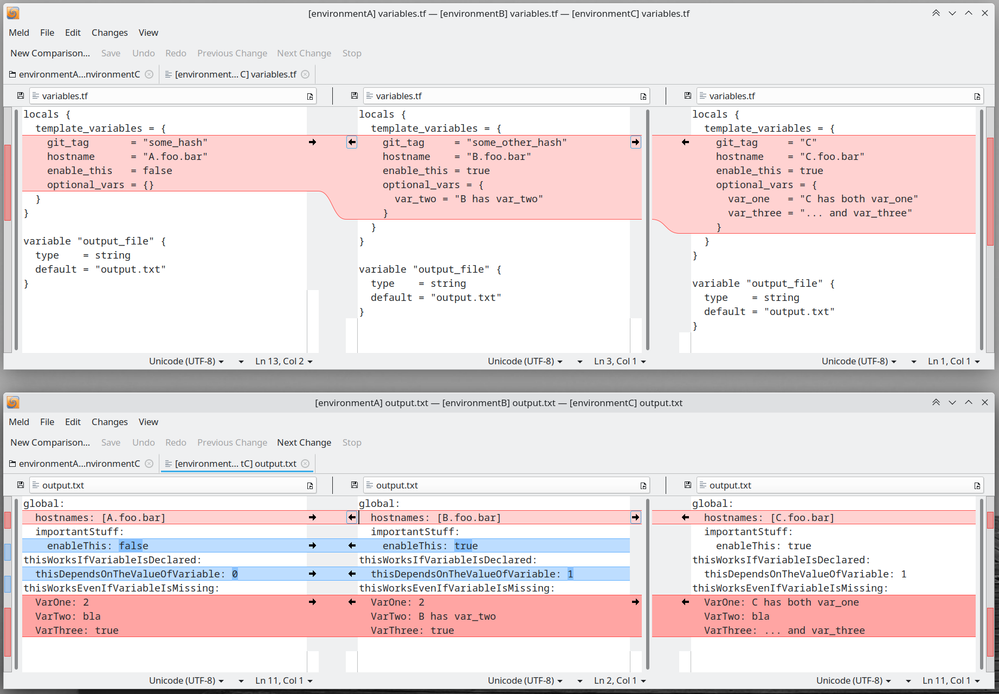

# Terraform Template Gimmicks

This is a small demo, showing how you can make use of "optional" variables in templates, replacing them with default values.

A picture is worth a thousand words:




For even more details see
- this [Hashicorp discussion](https://discuss.hashicorp.com/t/how-to-set-a-default-value-for-a-variable-in-a-terraform-template/12817/13)
- my [blog post](https://silviancretu.ro/terraform-template-gimmicks.html)


## The Scenario

- you have to manage multiple environments
- all the environments use the same configuration file, that is a template
- the template contains many variables
- some environments tend to be *snowflakes*, as they have non-default values
- should you want to edit the template to add these variables, with non-default values, for these snowflake environments, those variables will have to be added to each of the standard (non-snowflake) environments, as well; otherwise `terraform plan` and `terraform apply` will fail on all the environments
- basically, you don't want to replicate a *snowflake variable* to a *standard / non-snowflake environment*


## The Structure

```sh
$ tree 
.
├── common-template-file.tftpl
├── environmentA
│   ├── render-template.tf
│   └── variables.tf
├── environmentB
│   ├── render-template.tf
│   └── variables.tf
├── environmentC
│   ├── render-template.tf
│   └── variables.tf
├── environmentD
│   ├── render-template.tf
│   └── variables.tf
├── environmentE
│   ├── render-template.tf
│   └── variables.tf
└── README.md
```

So
- there's a common template for all environments
- each environment has its own directory
- each environment has a bunch of .tf files holding the Terraform code
- in `variables.tf` each environment has its own custom set of variables


## The Template and the Variables

The are two important sections in the template:

### the first one:
```HCL
  thisDependsOnTheValueOfVariable: %{ if enable_this == false }0%{ else }1%{ endif }
```
- `enable_this` is a variable that must exist in all `variables.tf` files
- **environmentE** doesn't have it and you'll see Terraform failing because of that
- depending on its value, another variable is set. 


### the second one:
```HCL
thisWorksEvenIfVariableIsMissing:
  VarOne: ${try(optional_vars.var_one, 2)}
  VarTwo: ${try(optional_vars.var_two, "bla")}
  VarThree: ${try(optional_vars.var_three, true)}
```
- `optional_vars` is a section (that can have any other name) that must exist in all `variables.tf` files
- **environmentD** doesn't have it and you'll see Terraform failing because of that
- but any variable nested under `optional_vars` is optional and can be missing


## How to Test and Run

Go to each environment and run `terraform plan` or even `terraform apply`, which will generate a file called `output.txt` for that environment, if the variables are not missing

Example:

```sh
cd environmentC/
terraform init; terraform apply -auto-approve
```
